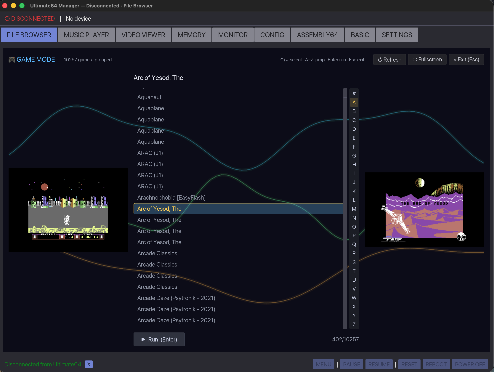
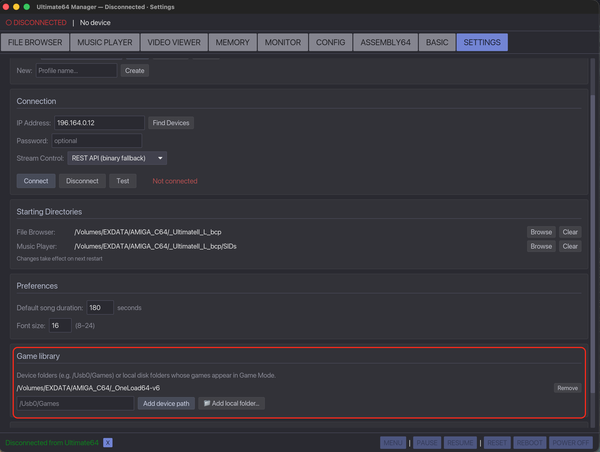
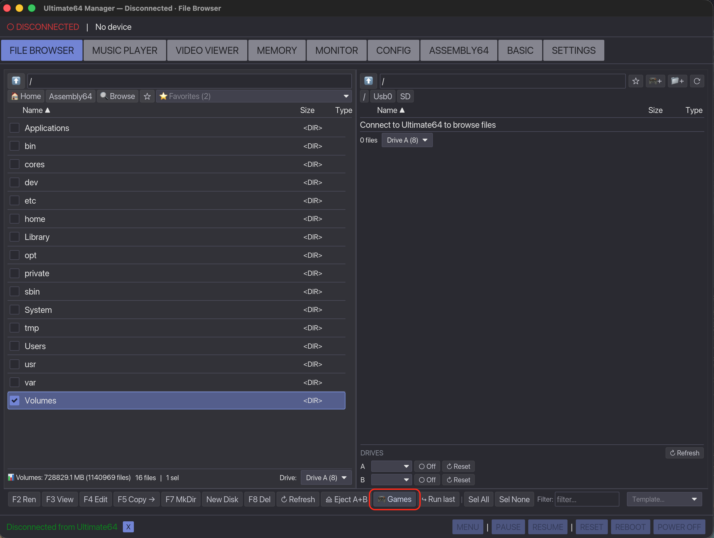
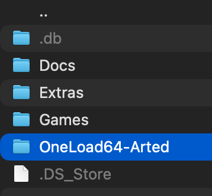
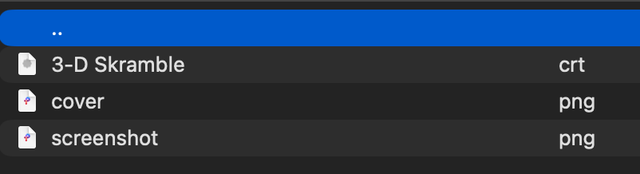

# Game Mode

Game Mode is a list for browsing and running game collections. It
reads folders you point it at — on the device (over FTP) or on your local
disk — figures out how the collection is laid out, and shows each game with its
box art and screenshot when available.

This guide walks through setting it up with a **OneLoad64** collection, which is
the easiest case because OneLoad64 already ships cover art keyed by game name.



---

## 1. Add a game library

A "library" is just a folder whose contents are games. You can add one three
ways:

- **Settings → Game library → Add device path** — type a path on the device,
  e.g. `/Usb0/OneLoad64` or `/SD/Games`, and click **Add device path**.
- **Settings → Game library → 📁 Add local folder…** — pick a folder on your
  computer's disk.
- **File Browser → device pane → 🎮+** — browse to a folder on the device and
  click the **🎮+** button in the toolbar to register the folder you're in.

You can add several libraries; they all appear together in Game Mode. Remove one
from **Settings → Game library**.



> Tip: add **one** clean folder. If you point at a parent that contains several
> copies of a collection (e.g. the raw set *and* a converted copy), each game
> shows up more than once.

## 2. Open Game Mode

In the **File Browser** tab, click **🎮 Games** in the bottom function bar.



It scans your libraries and lists the games. Controls:

| Key / button | Action |
|--------------|--------|
| `↑` / `↓`    | Move the selection |
| `a`–`z`, `0`–`9` | Jump to that letter section |
| `Enter` / **Run** | Run the selected game |
| **Fullscreen** | Hide the app chrome (tab bar / status bar) |
| **Refresh**  | Re-scan the library now |
| `Esc`        | Leave fullscreen, then leave Game Mode |

Running a **local** game uploads it to the device first; a **device** game runs
directly from the device filesystem. Disk images are mounted and auto-loaded.

The scanned list is cached, so re-opening Game Mode is quick. The cache
re-scans automatically when the top level of a library changes; use **Refresh**
to force it (e.g. after adding games deep inside a folder).

---

## Using a OneLoad64 collection

OneLoad64 is a flat set of `<Game>.crt` cartridges at the collection root, with
art stored centrally under `Extras/Images/`:

```
OneLoad64-Games-Collection-v5/
  10th Frame.crt
  1942 (Music v1).crt
  … ~2145 .crt …
  Extras/Images/Screenshots/<Game>.png      (in-game shot, one per game)
  Extras/Images/LoadingScreens/<Game>.png    (loading screen, ~half the games)
```

There are two ways to use it.

### Option A — point Game Mode straight at it

Add the OneLoad64 folder as a library (a device path if it's on the device, or a
local folder). Game Mode detects the **flat files** layout, lists every `.crt`,
and pulls each game's box art (loading screen, else screenshot) and screenshot
from `Extras/Images/` by matching the game's name.

This is the simplest option and needs no preparation.

### Option B — build a portable folder-per-game copy

If you want a self-contained library where each game sits in its own folder with
the art baked in as normal image files (works in any tool, easy to copy to a
device), use the helper script:

```bash
# copy mode — makes "<root> Arted" next to the original (~190 MB)
python3 tools/build_oneload_library.py ~/Downloads/OneLoad64-Games-Collection-v5

# or hard-link instead of copy (instant, no extra disk; same filesystem only)
LINK=1 python3 tools/build_oneload_library.py \
    ~/Downloads/OneLoad64-Games-Collection-v5 ~/Games/OneLoad64
```

It creates a `… Arted` folder next to the original:



…with one folder per game, holding the cartridge plus its matched art:

```
<out>/<Game>/
  <Game>.crt
  cover.png        (loading screen, or the screenshot if there is no loading screen)
  screenshot.png   (the in-game screenshot)
```



Then add that output folder as a library. Game Mode detects the
**one-folder-per-game** layout and shows `cover.png` as box art and
`screenshot.png` as the screenshot.

Re-run the script whenever a new OneLoad64 release comes out.

---

## How covers are matched

For each game, Game Mode looks for art in this order:

1. **An image next to the game** — in a game folder, an image whose name matches
   the program (`game.crt` → `game.png`/`game.jpg`), or a conventionally named
   `cover` / `box` / `front` / `screenshot` image.
2. **A central art folder** under the library root — it probes
   `Extras/Images/LoadingScreens`, `Extras/Images/Screenshots`, and plain
   `Screenshots` / `LoadingScreens` / `Images` / `Covers`, matching by the
   game's base name.

If nothing matches, the game still appears — it just shows a placeholder instead
of art. (OneLoad64 matches ~99% of games this way.)

## Supported layouts

Game Mode detects and handles these per library root:

- **Flat files** — runnable files sitting directly in the folder (OneLoad64).
- **Letter buckets** — subfolders like `A/`, `B/`, `0-9/` each holding games.
- **One folder per game** — each subfolder is a single game (a runnable plus its
  images).
- **Nested / grouped** — arbitrary folders it descends into to find the above.

## Notes

- Games must be in a runnable format: `.prg`, `.crt`, or a disk image
  (`.d64`/`.d71`/`.d81`/`.g64`…). `.zip` archives are **not** run directly.
- Local libraries don't need a device connection to browse; running a game does.
- The cache lives in the app config folder as `game_library_cache.json`
  (`~/.config/ultimate64-manager/` on Linux,
  `~/Library/Application Support/ultimate64-manager/` on macOS,
  `%APPDATA%\ultimate64-manager\` on Windows).
