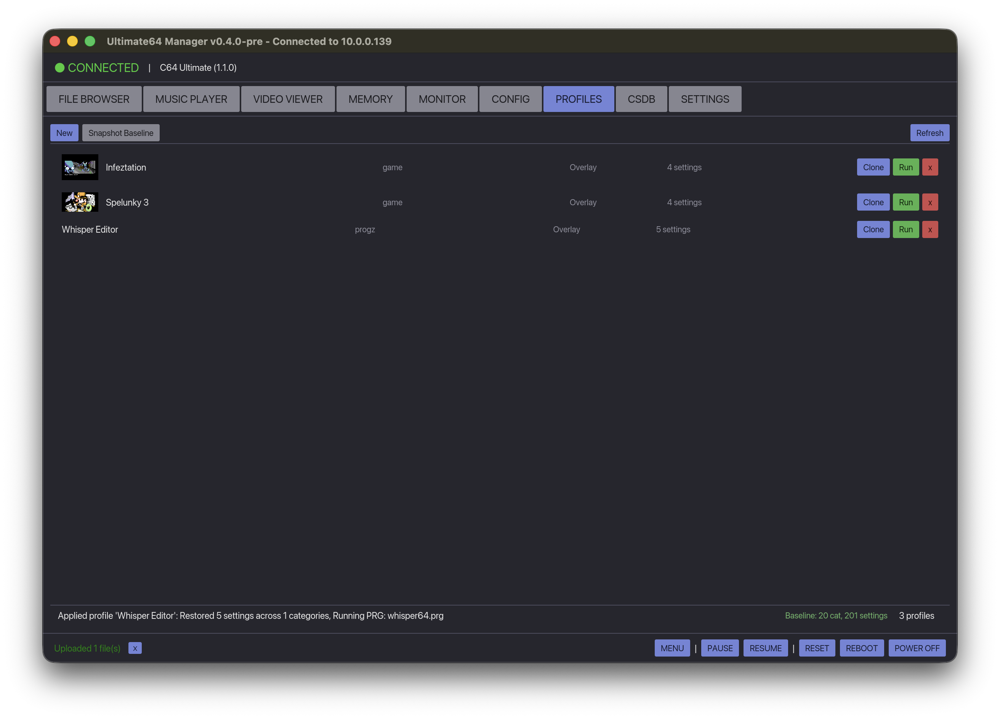
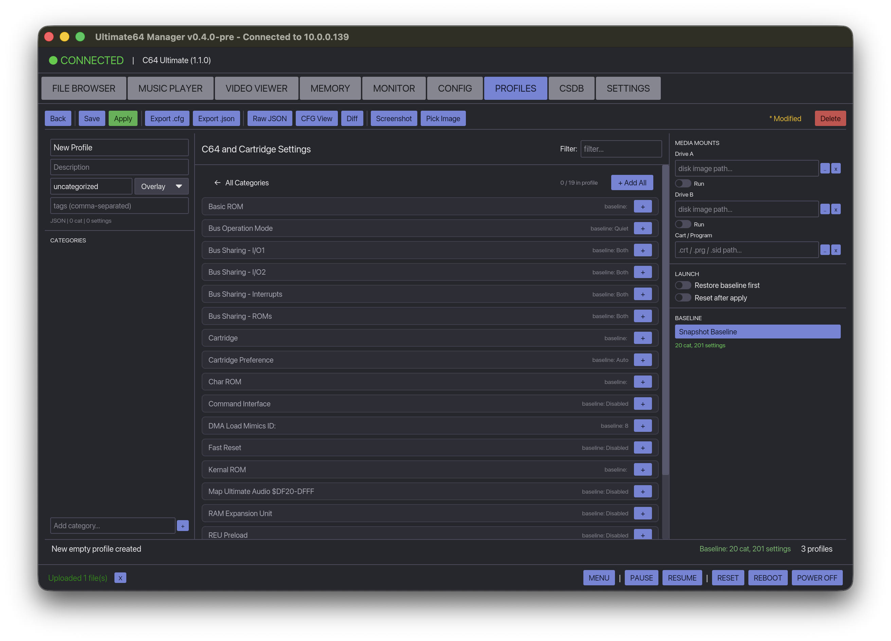
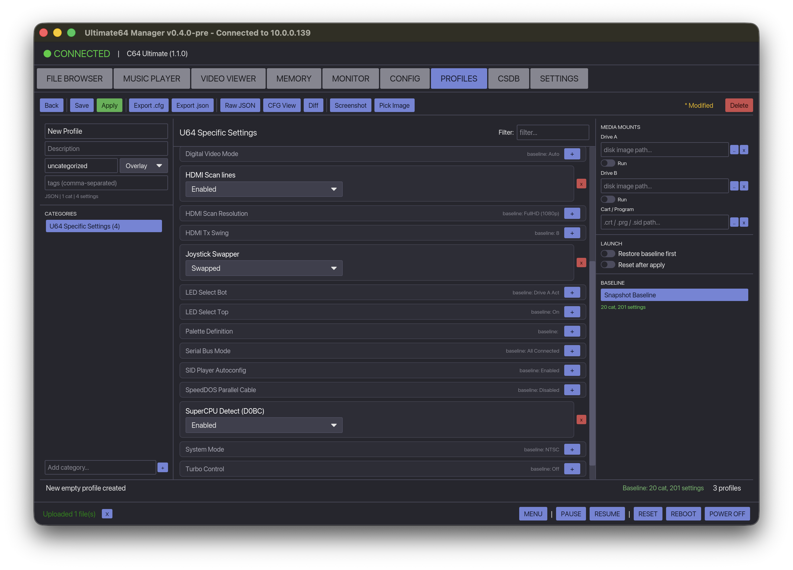
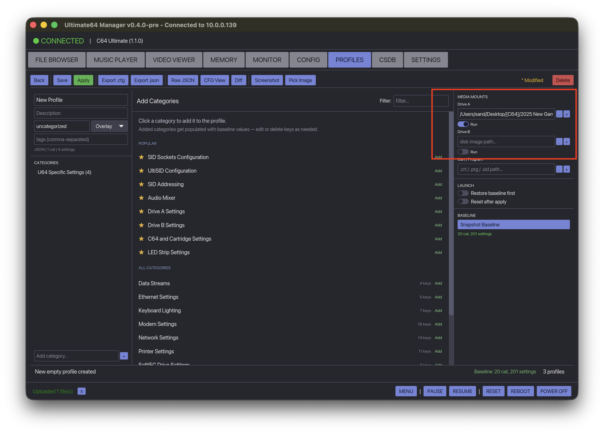
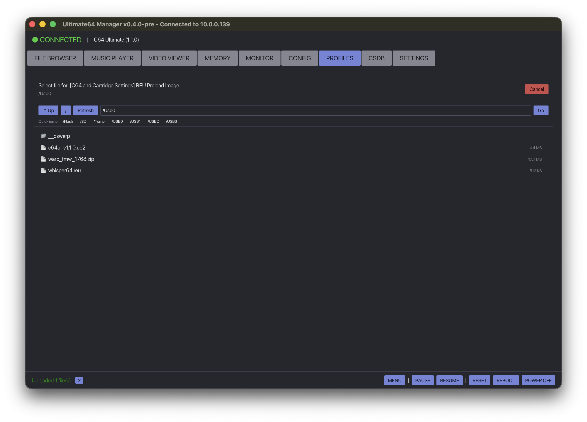

# Device Profiles



The Profiles tab lets you create, manage, and apply per-game or per-demo device configurations for your Ultimate 64, Ultimate 64 Elite II, or Ultimate-II+ device.

## Concepts

### Baseline

The **baseline** is a snapshot of your device's current configuration and schema (all valid values, ranges, defaults). It is captured once and stored locally. All profile diffs are computed against it -- no device reads at apply time.

**You must snapshot the baseline before creating or applying profiles.**

### Overlay vs Full

| Mode | Description |
|------|-------------|
| **Overlay** | Contains only the settings you want to override. Preferred for per-game profiles -- smaller, safer, leaves unrelated settings alone. |
| **Full** | Complete snapshot of every setting. Use for system-wide presets (PAL setup, NTSC setup, etc.) |

When applying an overlay, only the keys explicitly present in the profile are sent to the device. Everything else stays at its current value.

### Config Schema

The schema (valid dropdown values, integer ranges, defaults) is captured from the device API alongside the baseline. It is stored in the baseline file so it works offline. When editing a profile, settings with known schemas get proper dropdowns and sliders instead of plain text fields.

## Getting Started

### 1. Connect to the device

Enter the device IP in the connection bar and click Connect.

### 2. Initialize the profile repository

Go to the **Profiles** tab. If no repo exists, click **Init Repo**. This creates a profile repository at:

- **macOS**: `~/Library/Application Support/ultimate64-manager/profiles-repo/`
- **Linux**: `~/.config/ultimate64-manager/profiles-repo/`
- **Windows**: `%APPDATA%\ultimate64-manager\profiles-repo\`

> **Git is optional.** If `git` is installed, profiles are automatically version-controlled (commit on save, history, push/pull to remotes). If git is not installed, profiles still work as plain JSON files on disk -- you just lose version history and remote sync. Install git later to gain versioning retroactively (`git init` in the repo directory).

### 3. Snapshot the baseline

Click **Snapshot Baseline**. This reads all configuration categories from the device (takes ~30 seconds) and stores:

- The current value of every setting (the baseline)
- The schema: valid enum values, min/max ranges, default values

You only need to do this once. Re-snapshot after firmware updates or if you want a fresh baseline.

### 4. Create a profile



Click **New**. An empty overlay profile is created. Then:

1. **Name it** -- type a name in the top-left (e.g. "Last Ninja")
2. **Set the category** -- e.g. "games", "demos", "music" (organizes on disk)
3. **Add config categories** -- the center panel shows all categories from the baseline. Click a category (e.g. "U64 Specific Settings") to browse its keys.
4. **Add individual keys** -- each key has a `+` button to add it to the profile. Use `+ Add All` at the top to add every key from a category.
5. **Edit values** -- keys with a known schema show dropdowns (e.g. System Mode: PAL/NTSC) or sliders (e.g. Adjust Color Clock). Others show text inputs.
6. **Remove keys** you don't want to override using the red `x` button.

### 5. Edit config values



When a category is open, every key from the baseline is listed:

- **Keys in the profile** show their current value in an editable widget (dropdown, slider, toggle, or text field) with a red `x` to remove them.
- **Keys not yet added** appear greyed out with a `+` button and the baseline value as a hint.
- The top bar shows `N / M in profile` and a `+ Add All` shortcut.

Schema-driven widgets ensure you can only pick valid values -- no more typos causing 400 errors.

### 6. Add media mounts (optional)



In the right sidebar, configure disk images and cartridges to mount when the profile is applied:

| Slot | Supports | Path types |
|------|----------|------------|
| **Drive A** | D64, D71, D81, G64, G71, G81 | Local files (uploaded) or device paths |
| **Drive B** | Same as Drive A | Same |
| **Cart / Program** | CRT, PRG, SID | Local files (uploaded) or device paths |

- **Local paths** (e.g. `/Users/you/games/LastNinja.d64`) -- the file is uploaded to the device via multipart POST before mounting.
- **Device paths** (e.g. `/USB0/games/LastNinja.d64`) -- mounted directly via REST API.

Use the `..` button to pick a local file, or the `Browse...` button on path-like config keys to pick files from the device via FTP.

### 7. Set the Run toggle

Enable **Run** on a drive to execute the full load sequence when applying:

1. Enable the drive (if currently disabled)
2. Reset the machine (clean state)
3. Mount the disk image
4. Reset again (pick up the disk)
5. Type `LOAD "*",8,1` (or `,9,1` for Drive B)
6. Wait for the program to load
7. Type `RUN`

If Run is not enabled, the disk is only mounted (not auto-loaded).

### 8. Save the profile

Click **Save**. The profile is saved to the repository and committed automatically (if git is available).

### 9. Apply or Run

From the profile list:

- **Run** -- loads the profile, diffs against the baseline, sends only changed settings, mounts media, and executes the autoload sequence. All in one click.
- Click the profile name to open the editor for tweaking.

From the editor:

- **Apply** -- same as Run but from inside the editor.

## Profile List


The profile list shows all saved profiles with:

| Column | Description |
|--------|-------------|
| Thumbnail | Screenshot or picked image (48x36) |
| Name | Profile name (click to edit) |
| Category | Repository folder |
| Mode | Overlay or Full |
| Settings | Number of config keys |
| **Clone** | Duplicate the profile |
| **Run** | Apply the profile (one-click) |
| **x** | Delete the profile |

## Editing

### Adding a profile image

Two options in the editor toolbar:

- **Screenshot** -- captures the current C64 screen from the Video Viewer stream. Requires streaming to be active.
- **Pick Image** -- opens a file dialog to choose any PNG/JPG/GIF/BMP/WebP. The image is resized to max 1024px and converted to PNG.

The image is stored in the profile directory and shown as a thumbnail in the profile list.

### Viewing raw data

- **Raw JSON** -- shows the full profile JSON
- **CFG View** -- renders the profile as a native Ultimate .cfg file
- **Diff** -- shows what differs between the profile and the baseline

### Removing individual keys

Inside a category, each key has a red `x` to remove it from the profile. This is useful for trimming overlays down to only what matters.

### FTP file picker



Config keys that look like device paths (e.g. "REU Preload Image", "Default Path") have a **Browse...** button. Clicking it opens a full-screen FTP browser:

- Navigate directories, click files to select
- Quick-jump buttons for `/Flash`, `/SD`, `/USB0`--`/USB3`
- Manual path input for hidden mount points
- Refresh button for USB devices that appear after connection

## Export

- **Export .cfg** -- saves the profile's config as a native Ultimate .cfg file
- **Export .json** -- saves the full canonical profile JSON

## How the Diff Works

When you click **Apply** or **Run**:

1. The profile's `config` is compared against the stored baseline
2. A semantic comparison is used (handles type mismatches like `Number(8)` vs `String("8")`)
3. Only keys whose values actually differ are sent to the device
4. The diff is computed locally -- no device reads at apply time

If the device already matches the profile, nothing is sent ("No changes needed").

## Launch Options

| Option | Description |
|--------|-------------|
| **Restore baseline first** | Calls `load_from_flash` before applying, restoring the device's flash-stored defaults. Use when you want a clean slate. |
| **Reset after apply** | Resets the machine after config + mounts are applied. Usually not needed if Run is enabled on a drive (which handles its own reset). |

## Repository Layout

```
profiles-repo/
  baselines/
    default.json          # baseline config + schema
  profiles/
    games/
      last-ninja/
        profile.json      # canonical profile
        screenshot.png    # optional thumbnail
        original.cfg      # original imported .cfg (if applicable)
      wizball/
        profile.json
    demos/
      edge-of-disgrace/
        profile.json
```

If git is installed, the repository is a standard git repo. You can:

- `cd` into it and run `git log` to see history
- Push to a remote to share profiles
- Pull from a remote to sync across machines
- Edit `profile.json` files directly if needed

If git is not installed, the same directory structure is used but without `.git/`. Profile files are plain JSON -- you can back them up, copy them between machines, or add git later.

## Troubleshooting

### "No baseline captured yet"

Click **Snapshot Baseline** while connected to the device. This is required before creating or running profiles.

### "No schema -- re-snapshot for dropdowns"

The baseline file was saved before schema capture was added. Click **Snapshot Baseline** to refresh it. After that, config keys will show proper dropdowns and sliders.

### Settings rejected by the device (400 Bad Request)

This usually means a value doesn't match the device's expected format. Common causes:

- The baseline was captured before a value-preservation fix. Re-snapshot.
- Boolean values using the wrong pair (e.g. "Yes" vs "Enabled"). The editor now preserves the original pair.
- Leading spaces in values (e.g. `" 0 dB"` not `"0 dB"`). The parser now preserves these.

### USB not showing in FTP picker

The Ultimate firmware only lists mounted USB volumes in the FTP root directory. Use the quick-jump buttons (`/USB0`, `/USB1`, etc.) or type the path manually and click **Go**.
