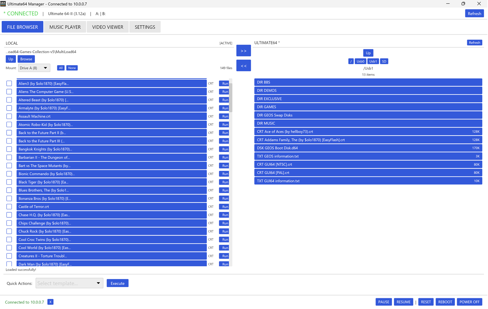

# Ultimate64 Manager

A cross-platform desktop application for managing Ultimate64 and Ultimate-II+ devices. Built with Rust and Iced.



## Features

- **Dual-Pane File Browser** - Local and remote file browsing side by side
- **FTP File Transfer** - Upload/download files via FTP with multi-file selection
- **Disk Management** - Mount D64, D71, D81, G64, G71 images to Drive A/B
- **Run Programs** - Direct load and run for PRG and CRT files
- **Music Player** - Play SID and MOD files with playlist support
- **Video Viewer** - Real-time VIC video stream capture
- **Machine Control** - Pause, Resume, Reset, Reboot, Power Off

## Building

### Prerequisites

- Rust 1.70+
- For macOS bundle: `cargo install cargo-bundle`

### Build

```bash
# Clone
git clone https://github.com/sandlbn/ultimate64-manager.git
cd ultimate64-manager

# Build
cargo build --release

# macOS bundle
cargo bundle --release
```

## Quick Start

1. Launch the application
2. Enter your Ultimate64 IP address
3. Click **Connect**
4. Browse files and transfer using the dual-pane browser

## Configuration

Settings are stored in:
- **Windows**: `%APPDATA%\ultimate64-manager\settings.json`
- **macOS**: `~/Library/Application Support/ultimate64-manager/settings.json`
- **Linux**: `~/.config/ultimate64-manager/settings.json`

## License

MIT License

## Acknowledgments

- [Ultimate64](https://github.com/GideonZ/1541ultimate) team
- [Ultimate64 Rust Library](https://github.com/mlund/ultimate64)
- [Iced](https://github.com/iced-rs/iced) GUI framework