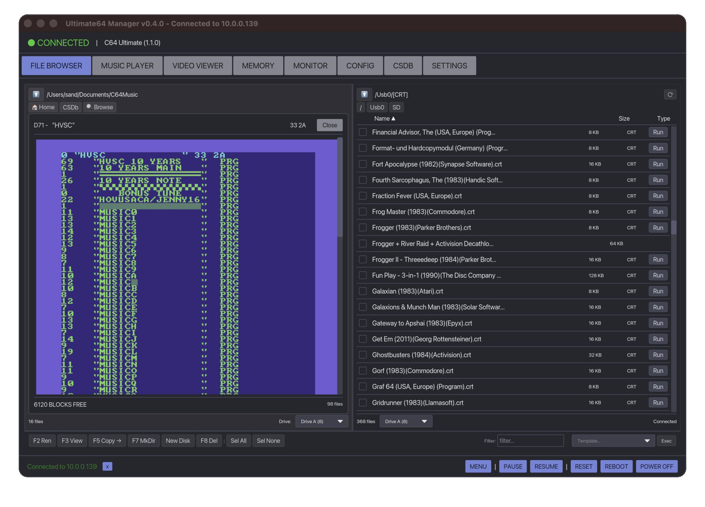

# Ultimate64 Manager

A cross-platform desktop application for managing **Commodore 64 Ultimate**, **Ultimate 64**, **Ultimate 64 Elite**, and **Ultimate-II+** devices. Browse files, mount disk images, stream VIC video/audio, play SID music, and edit device configuration.

[](https://buymeacoffee.com/sandlbn)



## Downloads

Prebuilt binaries for macOS, Windows, and Linux (AppImage) are available on the GitHub **Releases** page:
https://github.com/sandlbn/ultimate64-manager/releases

> **Required:** Enable the following services in the **Ultimate / Commodore menu** (not in this app): **Web Remote Control**, **FTP File Service**, **Ultimate DMA Service**, and **Ultimate Ident**.  
> If these services are disabled, **Ultimate64 Manager** will not be able to connect.


## Features

- **Dual-Pane File Browser** – Local and remote file browsing side by side
- **FTP File Transfer** – Upload/download files via FTP with multi-file selection
- **Remote Directory Browser** – Browse the Ultimate filesystem without mounting disks
- **Disk Image Viewer** – Display **D64/D71 directory contents** (C64-style listing)
- **Disk Management** – Mount D64, D71, D81, G64, G71 images to Drive A/B
- **Run Programs** – Direct load and run for PRG and CRT files
- **Music Player** – Play SID and MOD files with playlist support
  - Shuffle and repeat modes
  - Subsong navigation for multi-tune SID files
  - Song length database support (HVSC Songlengths.md5)
  - True pause/resume (freezes C64)
  - Configurable default song duration
- **Video Streaming** – Real-time VIC video with audio
  - Fullscreen mode (double-click or Opt+F / Alt+F)
  - Screenshot capture to Pictures folder
  - Unicast and multicast support
- **Audio Streaming** – SID audio output via UDP
- **Memory Editor** – Read and write C64 memory in real-time
  - Quick access to common locations (Screen, VIC-II, SID, CIA, Zero Page, etc.)
  - Hex, ASCII, Decimal, Binary display modes
  - Search for byte patterns or ASCII text
  - Fill memory ranges
  - Click-to-edit bytes
- **Configuration Editor** – Edit Ultimate configuration settings
- **Device Discovery** – Automatic network discovery of Ultimate devices
- **Configuration Profiles** – Save and load configuration profiles
- **Backup & Restore** – Full configuration backup and restore
- **Machine Control** – Pause, Resume, Reset, Reboot, Power Off
- **Remote Keyboard Input** – For BASIC and menus
- **CSDb Browser** – Search and browse releases from CSDb.dk
  - Search by category (All, Releases, Groups, SIDs)
  - Browse latest releases
  - View release details and file listings
  - Run PRG, CRT, SID, and disk images directly
  - Mount disk images with drive/mode selection
  - Download files to local storage
  
## Keyboard Shortcuts

| Shortcut | Action |
|----------|--------|
| `Opt+F` / `Alt+F` | Toggle video fullscreen |
| `ESC` | Exit fullscreen |

## Song Length Database

The music player can use the HVSC **Songlengths.md5** database for accurate song durations.
You can download it from the Music Player tab or place it manually at:

- **Windows**: `%APPDATA%\ultimate64-manager\Songlengths.md5`
- **macOS**: `~/Library/Application Support/ultimate64-manager/Songlengths.md5`
- **Linux**: `~/.config/ultimate64-manager/Songlengths.md5`

## Screenshots

Screenshots are saved to:

- **Windows**: `Pictures\Ultimate64\`
- **macOS**: `~/Pictures/Ultimate64/`
- **Linux**: `~/Pictures/Ultimate64/`

## Building

### Prerequisites

- Rust 1.81+
- **Linux (audio support required for streaming):**
  
```bash
sudo apt-get update && sudo apt-get install -y libasound2-dev
```

- For macOS bundle:
```bash
cargo install cargo-bundle
```

### Build

```bash
# Clone
git clone https://github.com/sandlbn/ultimate64-manager.git
cd ultimate64-manager

# Build
cargo build --release

# macOS bundle
cargo bundle --release
```

## Enabling Video & Audio Streaming

Streaming requires a wired Ethernet connection. Wi-Fi is not supported.

## License

MIT License

## Acknowledgments

- [Ultimate64](https://github.com/GideonZ/1541ultimate) team
- [Ultimate64 Rust Library](https://github.com/mlund/ultimate64)
- [Iced](https://github.com/iced-rs/iced) GUI framework
