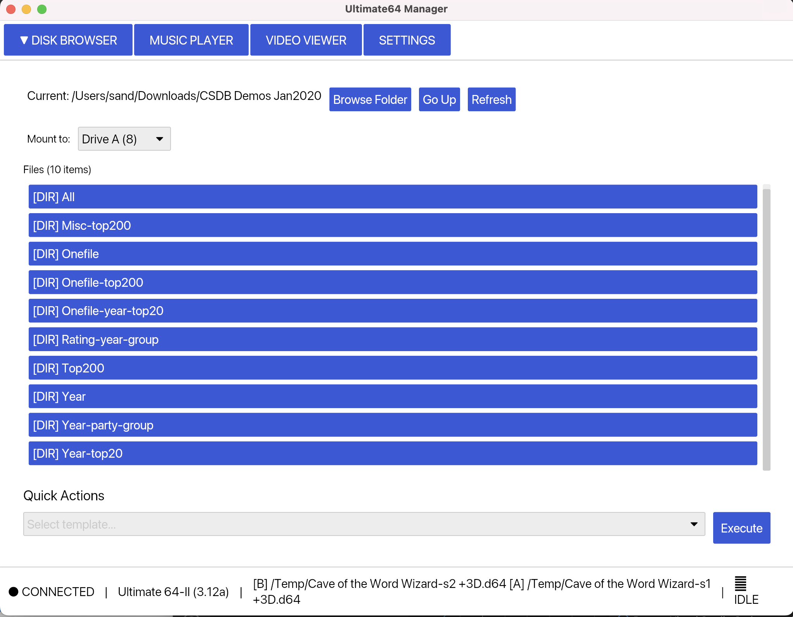

# Ultimate64 Manager

A desktop application for managing and controlling Ultimate64 devices. Built with Rust and Iced, this application provides a GUI interface for disk management, music playback, video streaming, and machine control.



## Features

### 🗄️ **Disk Browser & Management**
- Browse local directories for disk images and programs
- Support for multiple disk formats: D64, D71, D81, G64, G71
- Mount disk images to Drive A (8) or Drive B (9)
- Read-only and read-write mounting options
- Direct load and run for PRG and CRT files
- Recursive directory scanning
- Quick action templates for common operations

### 🎵 **Music Player**
- Play SID and MOD files directly on Ultimate64
- Playlist management with shuffle and repeat modes
- Multi-song SID file support with song selection
- Recursive music library scanning
- Volume control and playback time tracking
- Support for SID, MOD, S3M, XM, and IT formats

### 📺 **Video Viewer & Control**
- Real-time VIC video stream capture (UDP multicast)
- Screenshot functionality with timestamp
- Command prompt for direct BASIC/ML commands
- Command history tracking
- Machine reset and power control
- Frame rate: 384x272 @ 50Hz

### ⚙️ **Settings & Connection**
- Easy Ultimate64 network connection setup
- Password authentication support
- Connection status monitoring
- Device information display
- Mounted disk status in real-time
- Auto-connect on startup

## Installation

### Prerequisites

- Rust 1.70+ (with Cargo)
- Ultimate64 device on your network
- Ultimate64 firmware with REST API support

### Building from Source

```bash
# Clone the repository
git clone https://github.com/sandlbn/ultimate64-manager.git
cd ultimate64-manager

# Build in release mode
cargo build --release

# Build MacOS bundle
cargo bundle --release

# Run the application
cargo run --release
```
## Quick Start

### 1. **First Launch**
1. Start the application
2. Go to the **Settings** tab
3. Enter your Ultimate64's IP address (e.g., `192.168.1.64`)
4. Enter password if required (optional)
5. Click **Connect**

### 2. **Mount a Disk Image**
1. Switch to **Disk Browser** tab
2. Click **Browse Folder** to select your disk images directory
3. Choose **Drive A (8)** or **Drive B (9)** from the dropdown
4. Click **Mount A RW** (or **Mount B RW**) on any `.d64` file
5. Use **Quick Actions** templates for common operations like "Load and Run First"

### 3. **Play Music**
1. Go to **Music Player** tab
2. Click **Browse Folder** to select your music directory
3. Select any SID or MOD file from the playlist
4. Click **Play** to hear it on your Ultimate64
5. Use shuffle, repeat, and volume controls as needed

### 4. **Video Streaming**
1. Navigate to **Video Viewer** tab
2. Click **▶ START STREAM** to begin capturing VIC output
3. Take screenshots with the **📷 SCREENSHOT** button
4. Use the command prompt to send BASIC commands
5. Control the machine with **RESET** and **POWER** buttons

## Configuration

### Settings File Location
- **Windows**: `%APPDATA%\ultimate64-manager\settings.json`
- **macOS**: `~/Library/Application Support/ultimate64-manager/settings.json`
- **Linux**: `~/.config/ultimate64-manager/settings.json`

### Custom Templates
Create custom quick-action templates in:
- **Windows**: `%APPDATA%\ultimate64-manager\templates\`
- **macOS**: `~/Library/Application Support/ultimate64-manager/templates/`
- **Linux**: `~/.config/ultimate64-manager/templates/`

Example template (`my_template.json`):
```json
{
  "name": "Custom Loader",
  "description": "My custom loading sequence",
  "commands": [
    "RESET",
    "TYPE load\"*\",8,1\n",
    "TYPE run\n"
  ]
}
```

## Network Setup

### Ultimate64 Network Configuration
1. Ensure your Ultimate64 is connected to your network
2. Enable the REST API in Ultimate64 settings
3. Note the IP address from the Ultimate64 menu
4. Configure any firewall to allow connections on the REST API port

### Video Streaming Setup
The video streaming feature uses UDP multicast on `239.0.1.64:11000`. Ensure:
- Multicast is enabled on your network
- Firewall allows UDP traffic on port 11000
- Your computer is on the same network segment as the Ultimate64

## Supported File Formats

| Category | Extensions | Notes |
|----------|------------|-------|
| **Disk Images** | `.d64`, `.d71`, `.d81`, `.g64`, `.g71` | Full read/write support |
| **Programs** | `.prg`, `.crt` | Direct load and run |
| **Music** | `.sid`, `.mod`, `.s3m`, `.xm`, `.it` | Hardware playback |
| **Archives** | `.tap`, `.t64` | Display and browse |

## License

This project is licensed under the MIT License - see the [LICENSE](LICENSE) file for details.

## Acknowledgments

- [Ultimate64](https://github.com/GideonZ/1541ultimate) team for the amazing hardware
- [Ultimate64RustLibrary](https://github.com/mlund/ultimate64) for the nice Ultimate 64 Rust library
- [Iced](https://github.com/iced-rs/iced) for the excellent GUI framework
- Rust community for the fantastic ecosystem